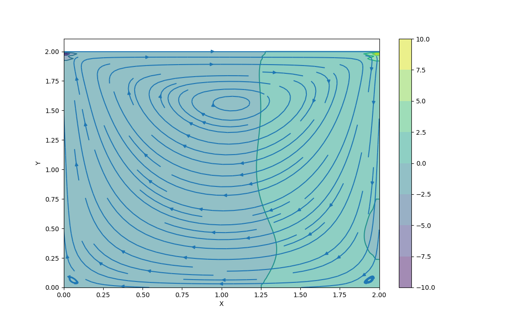

# XGrid

## Installation

```
pip install xgrid
```

## Test

Invoke `python3 test.py` in the root folder to perform the test cases.

## Usage

See document for more information. Let's start with a simple kernel, the element-wise multiplication of two grid:

```python
import xgrid
import numpy as np
import random

xgrid.init()

fvec = xgrid.grid[float, 1]

@xgrid.kernel()
def elementwise_mul(result: fvec, a: fvec, b: fvec) -> None:
    result[0] = a[0] * b[0]
```

and let's define some data:

```python
a = xgrid.Grid((10000, ), float)
b = xgrid.Grid((10000, ), float)

for i in range(10000):
    a[i] = random.random()
    b[i] = random.random()
```

and the result:

```python
result = xgrid.Grid((10000, ), float)
```

and invoke the kernel:

```python
elementwise_mul(result, a, b)
```

We could check the result using numpy dot:

```
assert np.sum(result.now) == np.dot(a.now, b.now)
```

## Examples

Solve the 2D Cavity flow with `xgrid`, see in examples folder.

